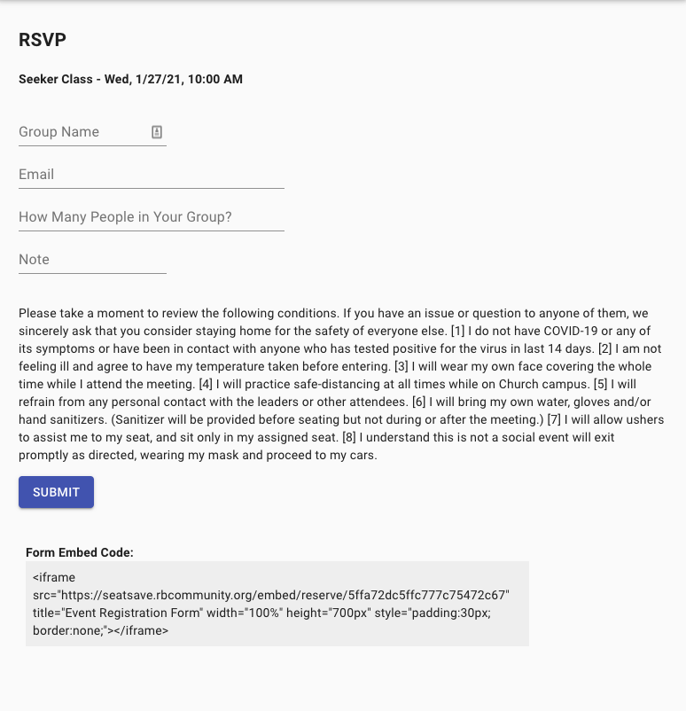
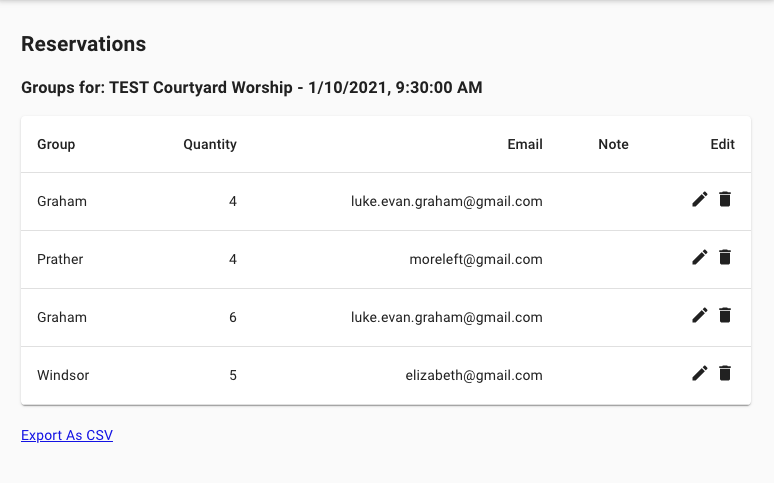

# SeatSave

## Overview

Deployed at https://seatsave.rbcommunity.org

A reservation system app empowering people to reserve seats at an organization's events.  The app also helps the hosting organization meet contract tracing obligations by tracking event attendee contact information.

## Views

### Event RSVP Form
The Event RSVP Form allows people to make reservations for upcoming events.  After submitting the form (processed with Redux-Form) the entered data is emailed (via Nodemailer) to the registrant and a confirmation view displays on-screen.  Also the "Open Spots" for the event are updated to reflect the reservation.

The form itself can be embedded on a separate website.  The embed code only displays to administrators.

### Confirmation View

### Event List
The Event List doubles as the app home screen.  All events are visible.  Administrators have additional options to edit and delete events.  Administrators can also view the reservations currently placed

### Event Create
Administrators can create events via the following form.

### View Groups List
Administrators can view, edit and delete any current reservations made for an event.  They can also add notes to a reservation.

### Settings
Administrators can access the Settings page.  Here the max group size can be adjusted, administrators can be added and removed and a signup message can be customized for the organization
